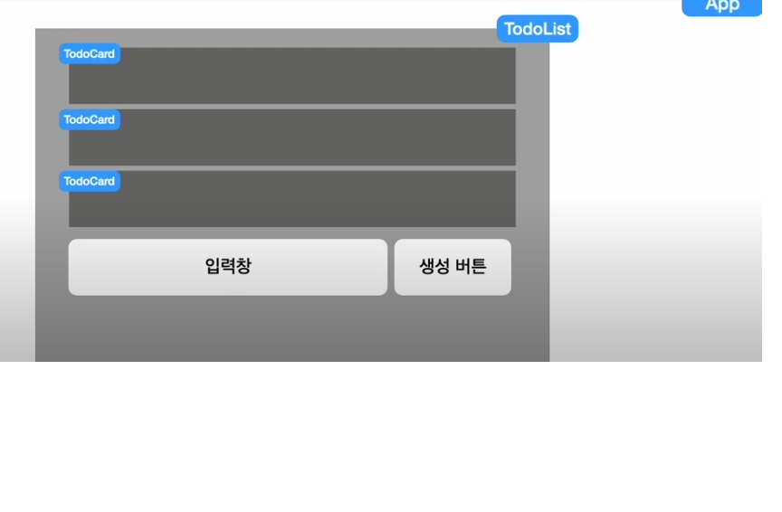

# 투두 리스트 연습하기

## 요구사항
- 추가, 수정, 삭제 조회 4가지 기능이 담겨져 있는 목록 만들기

## 컴포넌트 구성
- TodoList: 할일 정보 리스트 컴포넌트
  - 할일 목록을 보여줌
  - List 배열을 지니고 있음
- TodoCard: 단일 할일 정보
- TodoInput: 할일 정보 입력창
- ConfirmButton: 생성 버튼

## 화면 

